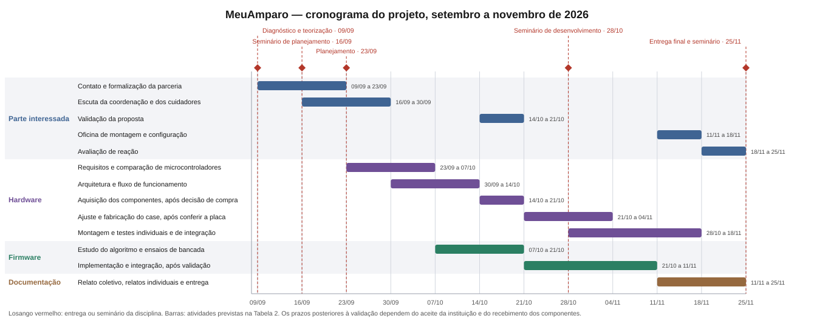

SOCIEDADE DE ENSINO SUPERIOR ESTÁCIO DE RIBEIRÃO PRETO

Campus Ribeirão Preto

Bacharelado em Ciência da Computação

Programação de Microcontroladores (ARA4710)

# MEU AMPARO

Dispositivo vestível de detecção de queda e localização para pessoas idosas

Planejamento do projeto

Luis Gustavo Moda – Matrícula 202402520751

Isabelly Vitoria – Matrícula 202608616779

Orientador: Prof. Omar Sacilotto Donaires

2026

Ribeirão Preto / SP

---

# 2. Planejamento e desenvolvimento do projeto

## 2.1 Plano de trabalho

O plano organiza o MeuAmparo de setembro a novembro de 2026. Ele segue as etapas do roteiro da disciplina: definir o escopo e os requisitos, modelar o sistema, validar a proposta com a parte interessada, desenvolver o firmware em C, testar por simulação e apresentar a solução à instituição.

Todo o desenvolvimento e os testes acontecem em simulação. O roteiro prevê simular o sistema embarcado e montar a versão física apenas se houver recursos. O grupo decidiu não comprar a placa neste semestre, porque não haveria tempo para receber os componentes, montar e testar antes da entrega final.

O acompanhamento é feito num quadro do GitHub Projects, apresentado no seminário de planejamento. Cada tarefa é uma issue com prazo, frente de trabalho, responsável e critério de conclusão, e cada entrega da disciplina é um marco. As Tabelas 2 e 3 e a Figura 1 foram montadas a partir desse quadro.

Tabela 1 – Entregas e seminários da disciplina

| Etapa | Seminário | Entrega |
| -- | ------------ | --------------- |
| 1 | Diagnóstico (workshop de canvas), 02/09 | Diagnóstico e teorização, seções 1.1 a 1.5, 09/09 |
| 2 | Planejamento, 16/09 | Planejamento do projeto, seções 2.1 a 2.5, 23/09 |
| 3 | Desenvolvimento, 28/10 | Detalhamento técnico e encerramento, 25/11 |
| 4 | Avaliação, 25/11 | — |

Fonte: calendário da disciplina atualizado na Aula 04 (2026).

Tabela 2 – Tarefas, prazos, responsáveis e acompanhamento

| Período | Tarefa | Frente | Responsável | Como acompanhar |
| ----- | ------------ | ------ | ------ | ------------ |
| 16/09 a 23/09 | Escrever e entregar o planejamento | Documentação | Gustavo e Isa | PDF postado na SAVA |
| 16/09 a 30/09 | Contatar as instituições e conseguir um aceite | Parte interessada | Isa | Aceite registrado |
| 16/09 a 30/09 | Definir o escopo e os requisitos funcionais | Documentação | Isa | Lista de requisitos, cada um com forma de verificação |
| 16/09 a 30/09 | Desenhar o diagrama de blocos e o fluxograma | Firmware | Isa | Diagramas no repositório |
| 23/09 a 07/10 | Conversar com a coordenação e os cuidadores | Parte interessada | Isa | Resumo da conversa conferido pela instituição |
| 07/10 a 14/10 | Validar a proposta com a instituição | Parte interessada | Gustavo e Isa | Reunião registrada, com os ajustes pedidos |
| 23/09 a 21/10 | Implementar o algoritmo de detecção de queda | Firmware | Gustavo e Isa | Testes automáticos com a taxa de detecção |
| 30/09 a 28/10 | Montar o circuito no simulador | Firmware | Gustavo e Isa | Simulação lendo o sensor e o botão |
| 21/10 a 28/10 | Apresentar o seminário de desenvolvimento | Documentação | Gustavo e Isa | Retorno do professor anotado |
| 14/10 a 11/11 | Completar o firmware | Firmware | Gustavo e Isa | Queda ou botão gerando alerta com posição, na simulação |
| 14/10 a 11/11 | Construir o backend e o painel de alertas | Backend | Gustavo e Isa | Alerta da simulação aparecendo no painel |
| 28/10 a 18/11 | Testar por função e com o sistema integrado | Firmware | Gustavo e Isa | Registro dos testes, com acertos e falhas |
| 11/11 a 18/11 | Apresentar a solução e orientar a equipe da instituição | Parte interessada | Gustavo e Isa | Tempo e dúvidas registrados |
| 18/11 a 25/11 | Aplicar a avaliação de reação | Parte interessada | Gustavo e Isa | Respostas do formulário resumidas |
| 11/11 a 25/11 | Escrever e entregar o detalhamento técnico e o encerramento | Documentação | Gustavo e Isa | PDF postado na SAVA |
| 18/11 a 25/11 | Apresentar o seminário de avaliação | Documentação | Gustavo e Isa | Apresentação feita |

Fonte: quadro do projeto no GitHub, em 23/09/2026.

Já foram concluídos a formação do grupo e a escolha do tema, o canvas apresentado em 02/09, o diagnóstico entregue em 09/09, a definição da arquitetura e o seminário de planejamento de 16/09.

Figura 1 – Cronograma do projeto

Fonte: quadro do projeto no GitHub, em 23/09/2026.

As tarefas com a instituição dependem do aceite de uma das candidatas. Se o contato atrasar, as datas de conversa, validação e apresentação serão combinadas de novo com a instituição e com o orientador.

## 2.2 Forma de envolvimento do público participante

A instituição parceira ainda está sendo procurada. As candidatas são a Casa do Vovô, o Lar Padre Euclides e o Lar do Vovô Albano, escolhidas num levantamento de catorze entidades cadastradas no Conselho Municipal do Idoso de Ribeirão Preto. O primeiro contato será por telefone e e-mail, com a carta de apresentação da faculdade, pedindo uma conversa de cerca de 20 minutos com a coordenação. Se nenhuma das três responder, o Conselho será procurado para indicar outra entidade.

No planejamento, a primeira conversa serve para ouvir a coordenação e os cuidadores: como é a rotina, que quedas e saídas já aconteceram, como a equipe fica sabendo e quem deveria receber o aviso. Essas respostas definem a prioridade das funções e entram nos requisitos.

No desenvolvimento, o grupo leva os requisitos e o desenho do sistema de volta à instituição antes de implementar, para que a equipe confirme ou peça ajustes. Os destinatários dos alertas e o que fazer depois de um aviso são decididos junto com ela.

Na avaliação, o grupo mostra a solução funcionando na simulação e explica como a instituição poderia montar e usar o dispositivo. Depois, coordenação e cuidadores respondem a um formulário de reação.

Pessoas idosas não participam de nenhum teste de queda. Neste semestre os testes são todos em simulação, com dados de referência.

Cada encontro terá um resumo conferido pela instituição. Fotos, capturas de tela, mensagens e formulários serão guardados com data e só com autorização de quem aparece.

## 2.3 Grupo de trabalho

O grupo tem dois integrantes. As partes centrais do sistema, o algoritmo, o firmware, a simulação e os testes, são feitas pelos dois, para que ambos aprendam a parte técnica. Cada um também lidera frentes próprias, como mostra a Tabela 3.

Tabela 3 – Papéis e responsabilidades

| Discente | Matrícula | Lidera | Faz junto |
| ----- | ----- | ------------ | ------------ |
| Luis Gustavo Moda | 202402520751 | Backend e painel de alertas; repositório, ferramentas e automação; modelo do case | Algoritmo, firmware, simulação, testes, validação com a instituição e revisão das entregas |
| Isabelly Vitoria | 202608616779 | Contato com a instituição e conversa com a equipe; requisitos; diagramas; cronograma e registros; avaliação com o público | Algoritmo, firmware, simulação, testes, validação com a instituição e revisão das entregas |

Fonte: divisão combinada pelo grupo e registrada no quadro do projeto (2026).

Essa divisão é a base dos relatos individuais da seção 3.2.

## 2.4 Metas, critérios ou indicadores de avaliação do projeto

As metas abaixo seguem os três objetivos da seção 1.4. São resultados pretendidos, ainda não medidos. Como o projeto não terá hardware físico neste semestre, cada meta diz como será verificada em simulação e quais medições dependem de uma montagem futura.

### Objetivo 1 – Desenvolver e avaliar o dispositivo

Etapas: definir os requisitos, desenhar o diagrama de blocos e o fluxograma, implementar o algoritmo de detecção, montar o circuito no simulador, completar o firmware e testar por função e com o sistema integrado.

Tabela 4 – Metas técnicas e forma de verificação

| Aspecto | Meta | Como verificar neste semestre |
| ----- | ------ | ----------------- |
| Detecção de queda | Pelo menos 90% das quedas | Rodar o algoritmo contra registros de queda de referência e contar acertos e falhas |
| Alarmes falsos | Menos de 1 por dia | Contar detecções indevidas em registros de atividades comuns, como caminhar, sentar e deitar. A taxa diária só pode ser medida em uso real |
| Pedido de ajuda | Botão gera alerta com posição | Acionar o botão na simulação e conferir o alerta recebido |
| Saída da área segura | Alerta em até 2 minutos | Simular posições saindo da área e medir o tempo até o alerta |
| Autonomia | Pelo menos 8 horas por carga | Estimar pelo consumo dos componentes e pelo tempo que o firmware passa ativo. A medição real depende da montagem |

Fonte: metas do projeto e procedimentos propostos pelos autores (2026).

O Wokwi não simula o modem 4G nem o GNSS. No teste, o alerta sai pelo Wi-Fi simulado e a posição vem de dados preparados. Por isso a simulação não valida a cobertura do 4G nem a precisão do GPS, e isso ficará registrado como limite dos resultados.

### Objetivo 2 – Publicar o projeto aberto

Etapas: publicar no repositório, sob licença GNU GPL v3, o código comentado, o diagrama, a lista de materiais com fornecedores, o modelo do case e as instruções para rodar a simulação e montar o dispositivo.

Critério: uma pessoa de fora do grupo consegue rodar a simulação seguindo só as instruções. O grupo anota o tempo, as dúvidas e as ajudas pedidas e ajusta a documentação a partir disso.

### Objetivo 3 – Orientar a equipe da instituição

Sem dispositivo físico, a oficina de montagem prevista no diagnóstico vira um encontro em que o grupo demonstra a simulação, explica como montar e configurar o dispositivo e entrega o material de apoio.

Critérios: um membro da equipe consegue configurar quem recebe os alertas em menos de 15 minutos, sem ajuda do grupo, e a avaliação de reação tem média de pelo menos 4 em 5. O relatório final apresenta o tempo, as ajudas pedidas, as respostas do formulário e o número de participantes, mesmo que as metas não sejam atingidas.

## 2.5 Recursos previstos

O grupo escolheu como plataforma de hardware de referência a placa Waveshare ESP32-S3-SIM7670G-4G, vendida no mercado nacional. Ela junta numa só peça o microcontrolador ESP32-S3, o modem 4G, o GNSS, o Wi-Fi e o Bluetooth, o que reduz a montagem e facilita que outra pessoa reproduza o dispositivo. O ESP32-S3 é o mesmo microcontrolador usado no firmware e no simulador, e o modelo do case foi desenhado para essa placa.

Tabela 5 – Custo estimado de uma unidade, para quem for montar o dispositivo

| Item | Estimativa |
| ---------------- | ------ |
| Placa Waveshare ESP32-S3-SIM7670G-4G | R$ 459,99 |
| Frete da placa | R$ 8,90 |
| Sensor MPU6050 | R$ 28,10 |
| Bateria 18650, 3500 mAh | R$ 45 a R$ 70 |
| Botão, buzzer e LED | R$ 15 |
| Barras de pinos, jumpers e parafusos | R$ 10 |
| Filamento PETG para o case | R$ 15 |
| Cordão com engate de segurança e clipe de cinto | R$ 15 |
| Total | R$ 597 a R$ 622 |
| Plano de dados e hospedagem | ainda não definidos |

Fonte: Cotacao-e-Compras.docx, preços consultados em 09/09/2026. São estimativas, não preços atuais nem comprovante de compra.

Nenhum componente será comprado neste semestre, então o projeto não tem custo financeiro para o grupo, para a faculdade nem para a instituição. A Tabela 5 fica como referência para quem quiser montar o dispositivo depois.

Recursos materiais: os computadores dos integrantes, o simulador Wokwi, o ESP-IDF para o firmware em C, o OpenSCAD para o modelo do case e o GitHub para versionar o código e acompanhar as tarefas. O Wokwi tem o ESP32-S3, o MPU6050, o botão, o buzzer e o LED. O roteiro da disciplina cita simuladores livres, e o Wokwi não é um deles; o grupo o escolheu porque é o simulador disponível que reproduz o ESP32-S3, e a escolha foi levada ao professor.

Recursos institucionais: a orientação do Prof. Omar Sacilotto Donaires e o tempo e o espaço da instituição parceira para as conversas e a apresentação, conforme o que for combinado.

Recursos humanos: as horas de trabalho dos dois integrantes e a participação da coordenação e dos cuidadores da instituição.
