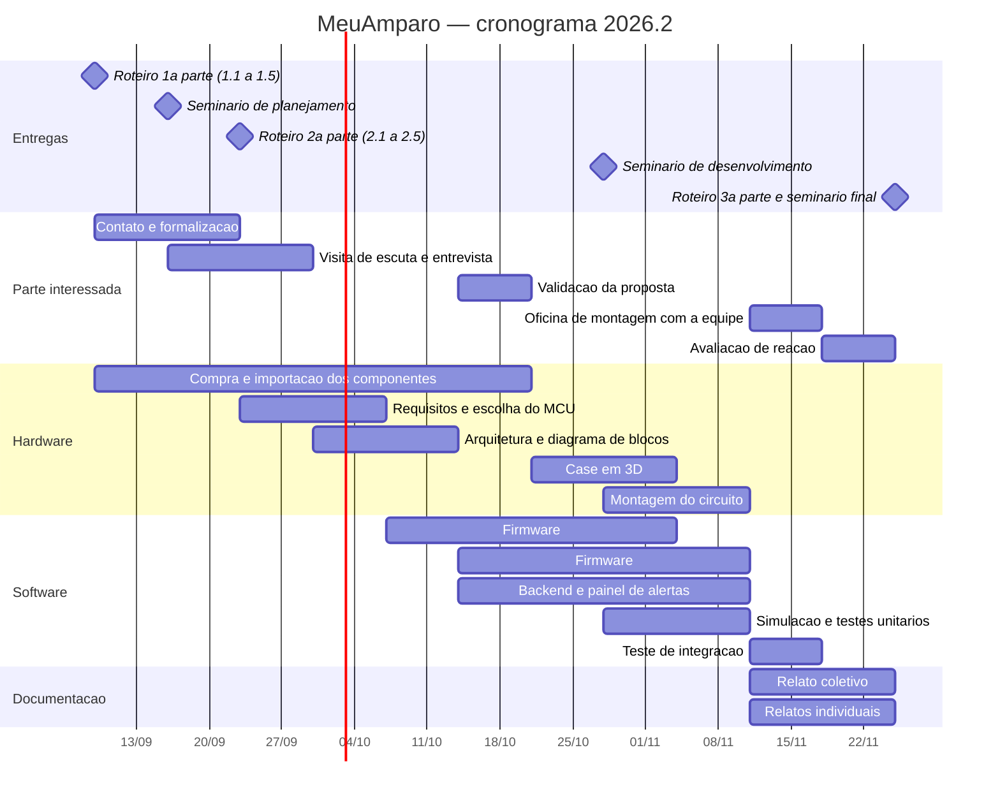

# MeuAmparo — Roteiro de Extensão

# 2. Planejamento e desenvolvimento do projeto

Entrega prevista: **23/set/2026** · Seminário de planejamento: **16/set/2026**

---

## 2.1 Plano de trabalho

### Cronograma

### Ações, prazos, responsáveis e acompanhamento

| # | Ação | Período | Responsável | Como acompanhamos |
|---|---|---|---|---|
| 1 | Entrega do Roteiro, 1ª parte (1.1 a 1.5) | 09/set | **[A]** | PDF postado na SAVA |
| 2 | Contato e formalização com a parte interessada | 09 a 23/set | **[A]** | Carta de apresentação e carta de autorização assinadas |
| 3 | Compra e importação dos componentes | 09/set a 21/out | **[B]** | Código de rastreio e chegada registrada |
| 4 | Visita de escuta e entrevista na instituição | 16 a 30/set | **[A]** e **[E]** | Roteiro de entrevista preenchido, fotos |
| 5 | Seminário de planejamento | 16/set | todos | Apresentação e feedback do professor |
| 6 | Entrega do Roteiro, 2ª parte (2.1 a 2.5) | 23/set | **[E]** | PDF postado na SAVA |
| 7 | Levantamento de requisitos e escolha do microcontrolador | 23/set a 07/out | **[B]** | Tabela comparativa de MCUs, decisão registrada |
| 8 | Arquitetura, diagrama de blocos e fluxograma | 30/set a 14/out | **[B]** e **[C]** | Diagramas versionados no repositório |
| 9 | Validação da proposta com a parte interessada | 14 a 21/out | **[A]** | Ata da reunião e aceite registrado |
| 10 | Firmware: leitura do IMU e detecção de queda | 07/out a 04/nov | **[C]** | Commits no Git, testes passando |
| 11 | Firmware: GPS, conectividade e envio do alerta | 14/out a 11/nov | **[C]** | Commits no Git, alerta chegando |
| 12 | Backend e painel de alertas | 14/out a 11/nov | **[D]** | Painel no ar, alerta visível |
| 13 | Modelagem e impressão do case | 21/out a 04/nov | **[B]** | STL no repositório, peça impressa |
| 14 | Simulação e testes das funções individuais | 28/out a 11/nov | **[C]** | Registro da simulação no SimulIDE |
| 15 | Seminário de desenvolvimento | 28/out | todos | Apresentação e feedback |
| 16 | Montagem do circuito e teste de integração | 28/out a 18/nov | **[B]** e **[C]** | Vídeo do teste de queda simulada |
| 17 | Oficina de montagem e configuração com a equipe | 11 a 18/nov | **[A]** e **[E]** | Cronômetro do exercício, fotos |
| 18 | Avaliação de reação da parte interessada | 18 a 25/nov | **[A]** | Formulário respondido e vídeo do depoimento |
| 19 | Relato coletivo e relatos individuais | 11 a 25/nov | todos | Texto revisado pelo grupo |
| 20 | Entrega final e seminário de avaliação | 25/nov | todos | PDF postado na SAVA |

**Oportunidade paralela:** o III EPEI recebe submissões até **21/set**, divulga aprovados em **24/set** e apresenta em **29/set**. O resumo pede de 2.000 a 5.000 caracteres sem espaços, em texto puro, sem tabelas nem figuras, com 3 a 5 palavras-chave. O material das seções 1.1 a 1.5 já cobre quase tudo o que o resumo exige.

### Marcos que não podem escorregar

Três datas seguram todo o resto. **23/set**, porque sem a parte interessada formalizada não há como escrever 2.2. **14/out**, porque a validação da proposta precisa acontecer antes de o firmware estar pronto, senão não é validação, é homologação do que já foi feito. **18/nov**, porque a avaliação de reação precisa de uma semana de folga antes da entrega final.

---

## 2.2 Forma de envolvimento do público participante

### No planejamento

O problema não foi levado pronto à instituição. A primeira visita é de escuta: uma conversa com a coordenação e com os cuidadores sobre a rotina do local, o histórico de quedas e episódios de desorientação nos últimos meses, o que já se usa hoje para lidar com isso e o que falha. Só depois dessa conversa o grupo prioriza qual problema atacar e apresenta uma proposta.

A proposta volta à instituição para validação antes de qualquer linha de firmware ser escrita, na ação 9 do cronograma. Se a equipe apontar que o formato de pendente não funciona para o público deles, ou que o alerta precisa chegar de outro jeito, o projeto muda ali, não no fim.

### No desenvolvimento

Os cuidadores participam de duas formas concretas. Primeiro, definindo o comportamento do alerta: quem recebe, em que ordem, quanto tempo o dispositivo espera antes de disparar. São decisões de operação, e quem opera é a equipe, não o grupo. Segundo, testando: as quedas simuladas para calibrar o algoritmo são feitas por voluntários da equipe, com o dispositivo no corpo, e o retorno deles sobre peso, incômodo e posição alimenta o ajuste do case.

### Na avaliação

Três instrumentos, todos com o público como sujeito e não como observado:

1. **Teste assistido de detecção.** Voluntários simulam quedas em ambiente controlado, com colchonete. Registramos acertos, falhas e alarmes falsos.
2. **Exercício de autonomia.** Um membro da equipe configura um dispositivo do zero, sem intervenção do grupo, cronometrado. É a verificação direta do objetivo 3.
3. **Avaliação de reação.** Formulário aplicado à coordenação e aos cuidadores, com depoimento em vídeo de quem quiser falar.

### Estratégias de mobilização

O primeiro contato é feito pessoalmente, com a carta de apresentação da Estácio em mãos, e não por e-mail. Instituição pequena responde a quem aparece. As reuniões são marcadas no horário que couber na rotina da equipe, não na do grupo. Cada encontro termina com o combinado seguinte já marcado. E o grupo devolve alguma coisa em cada visita, nem que seja o resumo da conversa anterior por escrito, para que a relação não seja só de extração de informação.

### Registros

Todo encontro gera evidência: fotos da visita com autorização de uso de imagem, ata ou resumo enviado à instituição por mensagem, formulários preenchidos, capturas de tela das conversas, vídeo dos testes e da oficina. As evidências são anexadas ao roteiro e organizadas por data.

> **[PENDÊNCIA]** Providenciar o termo de autorização de uso de imagem antes da primeira visita.

---

## 2.3 Grupo de trabalho

> **[PREENCHER]** Grupo em formação. Os papéis abaixo são a proposta de divisão; substituir as letras pelos nomes e matrículas.

| Papel | Responsabilidades | Atividades no cronograma |
|---|---|---|
| **[A]** — Coordenação e relação com a parte interessada | Manter o contato com a instituição, conduzir as visitas, cuidar da documentação de formalização e das evidências | 1, 2, 4, 9, 17, 18 |
| **[B]** — Hardware | Seleção e justificativa do microcontrolador, compra dos componentes, montagem do circuito, modelagem e impressão do case | 3, 7, 8, 13, 16 |
| **[C]** — Firmware | Desenvolvimento em linguagem C: leitura do IMU, algoritmo de detecção, GPS, comunicação, simulação e testes | 8, 10, 11, 14, 16 |
| **[D]** — Backend e interface | API, recebimento dos alertas, painel web de monitoramento e histórico | 12 |
| **[E]** — Documentação | Redação do roteiro, organização das evidências, preparação das apresentações dos seminários | 4, 6, 19 |

Todos os integrantes participam dos quatro seminários e escrevem o próprio relato individual. As habilidades técnicas exigidas pela disciplina — distinção entre tipos de microcontroladores, programação em C, uso de periféricos internos e externos, protocolos I²C, UART e SPI, e interrupções — são demonstradas por todos, e não apenas por quem tem o papel de firmware. Para isso, as revisões de código são feitas em dupla e cada integrante apresenta pelo menos uma parte técnica nos seminários.

---

## 2.4 Metas, critérios e indicadores

### Objetivo 1 — Desenvolver o dispositivo de detecção e alerta

| Etapa | Critério | Indicador |
|---|---|---|
| Escolha do microcontrolador | Decisão justificada por requisitos, não por hábito | Tabela comparativa com ao menos 4 famílias, avaliadas em consumo, tamanho, custo, memória e periféricos |
| Detecção de queda | O algoritmo distingue queda de atividade cotidiana | **Ao menos 90% das quedas simuladas detectadas** e **menos de 1 alarme falso por dia** por dispositivo |
| Localização | O alerta informa onde a pessoa está | Coordenada obtida em ambiente aberto; em ambiente fechado, identificação por rede conhecida |
| Alerta de área segura | Saída da área gera aviso em tempo útil | **Alerta emitido em até 2 minutos** após cruzar o limite |
| Autonomia | O dispositivo cobre um dia de uso | **Mínimo de 8 horas** por carga, medido em uso contínuo |
| Custo | Replicável por uma organização social | **Até R$ 500 por unidade**, com nota de compra |

### Objetivo 2 — Documentar como projeto aberto

| Etapa | Critério | Indicador |
|---|---|---|
| Publicação | Tudo o que é necessário para replicar está disponível | Repositório público com esquema, lista de materiais com fornecedores, modelo do case, código-fonte e licença MIT |
| Roteiro de montagem | Qualquer pessoa com o kit consegue montar | Documento com passo a passo e fotos de cada etapa |
| Verificação | A documentação basta sem apoio verbal | Uma pessoa de fora do grupo monta uma unidade seguindo só o documento |

### Objetivo 3 — Capacitar a equipe da instituição

| Etapa | Critério | Indicador |
|---|---|---|
| Oficina | A equipe recebeu formação prática | Oficina realizada, com lista de presença e registro fotográfico |
| Autonomia de configuração | A equipe opera sem o grupo | **Um membro da equipe configura um dispositivo do zero, sozinho, em menos de 15 minutos** |
| Satisfação | A solução atende quem vai usar | **Nota mínima 4 em 5** na avaliação de reação, com depoimento em vídeo |

---

## 2.5 Recursos previstos

### Materiais — uma unidade de protótipo

| Item | Especificação | Custo | Fonte do recurso |
|---|---|---|---|
| Placa principal | LilyGO T-A7670G R2 com GPS: ESP32-WROVER, 4G LTE Cat-1, GNSS, carregador e suporte de bateria, com antenas 4G e GPS | R$ 169 | grupo |
| Sensor inercial | MPU6050, acelerômetro e giroscópio de 3 eixos | R$ 28 | grupo |
| Bateria | 18650 recarregável, 3500 mAh | R$ 55 | grupo |
| Interface | Botão de pânico, buzzer, LED, barras de pinos, fios e parafusos | R$ 25 | grupo |
| Case | Impressão em PETG e cordão com engate de segurança | R$ 30 | grupo |
| Placa portadora | PCB própria, lote de 5 | R$ 12/un | grupo |
| Importação | Frete e ICMS | R$ 100 | grupo |
| **Total** | | **R$ 419 por unidade** | |
| Conectividade | Chip de dados M2M | mensalidade a definir | a negociar com a operadora ou com a instituição |

Compras internacionais de até US$ 50 estão isentas do Imposto de Importação federal desde maio de 2026, incidindo apenas o ICMS estadual. A placa fica abaixo desse limite.

### Institucionais

- Laboratório e impressora 3D da Estácio Ribeirão Preto. Alternativa sem custo de fabricação: caixa plástica comercial, cerca de R$ 25.
- Espaço e horário da instituição parceira para as visitas, testes e oficina.
- Orientação do Prof. Omar Sacilotto Donaires.

### Humanos

- Horas de trabalho dos integrantes do grupo, distribuídas conforme a seção 2.3.
- Tempo da coordenação e dos cuidadores da instituição nos encontros, testes e avaliação.

### Estratégias de contenção de custo

Todo o ferramental é livre e sem licença: **ESP-IDF** para o firmware, **SimulIDE** para a simulação, **FreeCAD ou OpenSCAD** para o case e **Git** para o versionamento. O Roteiro de Extensão aceita desenvolvimento e teste por simulação computacional, o que significa que o projeto não depende financeiramente da compra do hardware para ser entregue. A montagem física é um ganho adicional, custeado pelo grupo, e não um requisito de aprovação.

---

# Apêndice — Roteiro do seminário de planejamento (16/set)

**Formato:** grupos sorteados, **3 minutos por integrante**. Cada um explica **qual foi sua contribuição** ao trabalho até aqui e **o que aprendeu**. A nota do seminário compõe a nota da entrega de 23/set.

### Fio condutor do grupo, em três frases

> Idosos que caem sozinhos ficam horas sem socorro, e quem tem demência pode sair e não saber voltar. Existe dispositivo no mercado, mas ele cobra mensalidade, manda os dados para fora do país e é configurado por comando SMS que ninguém consegue usar. Nosso projeto entrega o mesmo resultado como kit aberto de até R$ 500, que a instituição monta e opera sozinha.

### Divisão sugerida das falas

| Quem | Contribuição a relatar | Aprendizado a destacar |
|---|---|---|
| **[A]** | Contato com a instituição, escuta e formalização | O problema real não era o que imaginávamos antes de conversar com a equipe |
| **[B]** | Levantamento de componentes e custo | Comprar módulo avulso no Brasil custa mais que a placa integrada importada, e isso muda o projeto |
| **[C]** | Estudo do algoritmo de detecção | A queda tem quatro estágios, e é a imobilidade posterior que separa a queda de sentar bruscamente |
| **[D]** | Arquitetura do alerta e dos dados | Localização de idoso é dado sensível, e a LGPD entra no projeto como requisito técnico |
| **[E]** | Estado da arte e documentação | Existem dezenas de projetos abertos parecidos, e mapear o que eles não fazem foi o que definiu nosso recorte |

### Três perguntas prováveis do professor

**"Por que ESP32 e não outro microcontrolador?"** — Porque os requisitos pedem Wi-Fi e Bluetooth integrados, potência para o algoritmo de detecção, custo baixo e disponibilidade nacional. A comparação formal com outras famílias é a entrega de 07/out.

**"E se a placa não chegar?"** — O roteiro aceita simulação em software livre. O SimulIDE cobre a exigência, e o hardware físico é um ganho, não um requisito.

**"Qual é a parte interessada?"** — **[PREENCHER com a resposta honesta do estágio em que o contato estiver na data.]**
